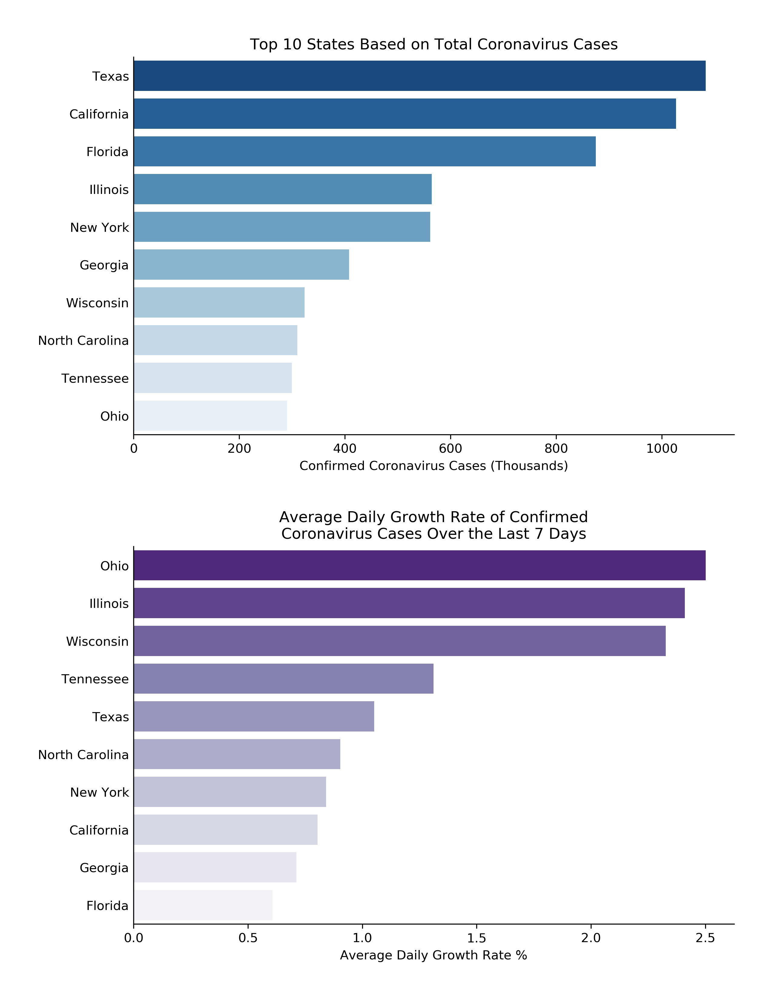

# COVID-Data-Analysis

These python scripts were created to track the spread of COVID-19.

One of the scripts is for analyzing United States data, whereas the second script analyzes worldwide data.

The scripts calculate statistics such as deaths per capita and output plots that allow the comparison of different states and countries.

There are no additional files that must be included because the data comes from online sources. Therefore, at some point the links may become inaccessible and the scripts would need to be modified for an alternative data source.

The scripts output plots as .jpg files in the working directory.

Example plots:

